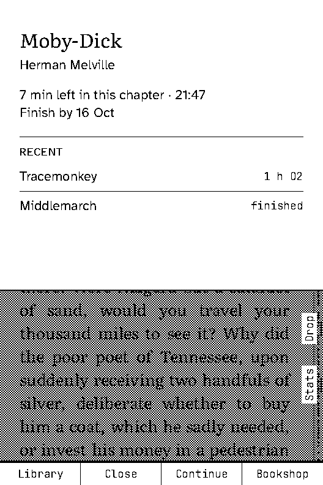
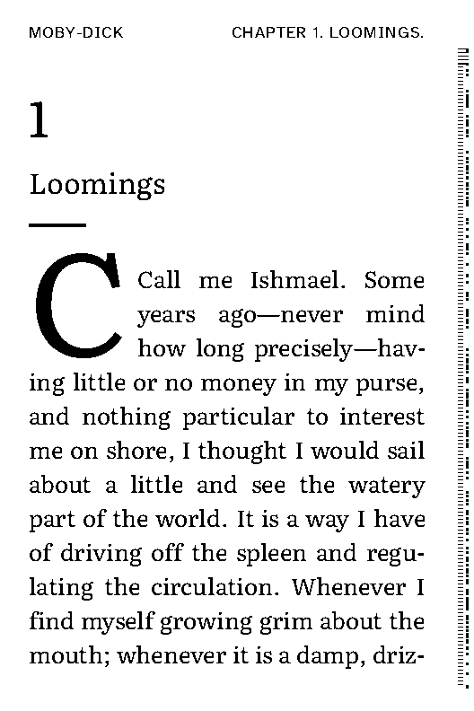

# Quire

[](https://github.com/arrowassassin/quire/actions/workflows/ci.yml)
[](#licence-and-credits)
[](#hardware)

Quire is open-source e-reader firmware for the Xteink X3, written in Rust from scratch. It treats the reader as a printed object, not a device: black ink on white paper, seven keys, and the book as the home screen. There is no launcher to cross, no percentage bar, no account. You press Confirm and you are reading; everything else is one or two presses away behind edge labels, and the interface gets out of the way of the page. The firmware is complete and ready to flash: every screen in this repository is real code, rendered by the same layout engine that runs on the device.

Website: <https://arrowassassin.github.io/quire/>

Quire is an unofficial community project. It is not affiliated with, endorsed by, or supported by Xteink.

| Home | Reading | Sleep |
|---|---|---|
|  |  |  |

## Contents

- [What it does](#what-it-does)
- [Hardware](#hardware)
- [Install](#install)
- [Updating](#updating)
- [Recovery](#recovery)
- [The microSD card](#the-microsd-card)
- [Building from source](#building-from-source)
- [Repository map](#repository-map)
- [Architecture](#architecture)
- [Contributing](#contributing)
- [FAQ](#faq)
- [Licence and credits](#licence-and-credits)

## What it does

### Reading and typography

Text is set in Literata at six sizes: 22, 24, 26, 28, 31 and 34 px. The bold and italic strikes are real faces baked from the TTFs at build time, not synthesised; bold italic is the italic strike dilated. Lines are justified and hyphenated in seven languages (English, German, French, Spanish, Italian, Dutch and Portuguese), with drop caps, footnotes, images and chapter headings.

The Spine is a strip down the edge of the page that shows where you are in the book and where the chapters fall. Time left in the chapter is shown instead of a percentage. Skim scrubs through the book along the Spine, Go to jumps to a page or a chapter, Contents lists the chapters, and the cursor selects any word on the page to look it up, highlight it or note it. Jump is one filtered list that reaches every book, screen, app and game, typed on the device or from the phone keyboard.

The interface is set in Atkinson Hyperlegible and JetBrains Mono. First run asks for an interface language (English, German, French or Spanish), the time, and where your books are.

### Formats

| Format | Notes |
|---|---|
| EPUB, KEPUB | EPUB 2 and 3, streamed from the card without building a DOM |
| PDF | Cross-reference tables, object streams, filters, the page tree, font encodings and ToUnicode maps. Text pages reflow into the same typography as everything else; scanned pages are shown as images |
| TXT | Plain text, paragraph detection |
| Markdown | |
| FB2 | FictionBook 2 |
| HTML | A single HTML or XHTML file |
| CBZ | Comic book ZIP |
| QBK | Quire's own pre-laid-out container |
| JPEG, PNG, BMP | A lone image opens as a one-page book |

Detection is by extension first and by the file's leading bytes when the extension says nothing, so a book with no extension still opens. A book is ingested once into a compact token stream on the card; pages are then laid out on demand and indexed per typography profile, which is why changing the type size does not re-read the whole book. Encrypted and DRM-protected files are refused with a message that says so.

### Getting books over Wi-Fi

The Drop page is served by the reader itself. Join your own Wi-Fi network, or let the reader raise its own access point, named `Quire-XXXX` after the last two bytes of its MAC address with a generated eight-character password made only of characters that are unambiguous on an e-ink screen. The screen shows a QR code; the page is at `http://quire.local` (or `192.168.4.1` on the reader's own hotspot). It offers:

- uploads, streamed straight to the card
- a live mirror of the panel, so you can see what the reader is showing
- typing into any text field on the device from the phone keyboard
- a JSON API: `/api/status`, `/api/library`, `/api/stats`, `/api/screen.pbm`, `/api/settings`, and `/api/files/...` for get, put, rename and delete
- Fetch a link, which hands the reader a URL and lets it do the download

Beyond the Drop page there is a Bookshop with a catalogue of 88 public-domain books from Project Gutenberg, kept in this repository under `bookshop/`; OPDS catalogues (1.x Atom and 2.0 JSON); Calibre wireless device support; and KOReader progress sync, which names documents by KOReader's partial MD5 digest so both readers agree about the same file.

Everything over HTTPS goes through TLS 1.3 with a certificate verifier written for this project: chain building against a compiled-in root store, `cA` and `pathLenConstraint`, dNSName name constraints, RFC 6125 host matching, RSA PKCS#1 v1.5 and PSS, ECDSA P-256 and P-384.

### The dictionary

WordNet 3.1 is compiled into a 1,548,664-byte `.qdict` blob with 83,253 headwords, flashed to its own partition and read straight off flash: a lookup inflates one 4 KB block at a time and holds nothing else in RAM. Put the cursor on a word and press Confirm. StarDict dictionaries on the card work too: drop the `.ifo`, `.idx` and `.dict` files into `/dict` and Quire builds a small `.qix` index beside each one on first use.

### Apps

Clock with a timer and alarms, weather (Open-Meteo, no key needed), news from RSS and Atom feeds, Wikipedia, notes, flashcards, a calculator, interactive fiction (a Z-machine interpreter), and an image viewer.

### Games

Chess, sudoku, minesweeper, 2048 and Wordle.

### Analytics

Reading rhythm, a calendar of reading days, goals, pages per book and a year in review. All of it is computed on the device from its own session log. Nothing is uploaded and nothing is fetched to produce it.

### Sleep screens with a live clock

The sleep screen can be the cover of the book you are reading, a poster, a quotation, a quick-resume card, blank, or an image from a pack. Every pack image leaves a clean rectangle for the time, so during light sleep the firmware repaints only that rectangle once a minute rather than the whole panel. Ten packs of five images each, fifty images in all, are in `sleep-packs/`; the reader can download them over HTTPS or you can copy them to the card.

### Updates and recovery

Updates arrive over Wi-Fi from this repository's releases or from a file on the card, are written to the spare OTA slot and verified twice, and roll back on their own if the new firmware cannot boot. A separate recovery app sits in the factory partition and is reachable by holding a key at power-on. See [Updating](#updating) and [Recovery](#recovery).

### Privacy

No account, no telemetry, no analytics upload, no DRM support, no advertising identifiers. The reader makes a network request when you ask it to: opening the Drop page, downloading a book, refreshing a feed, syncing progress, checking for an update, or taking one time fix over SNTP per Wi-Fi session. Reading statistics are stored on the card and never leave it.

## Hardware

Quire targets one device today, the Xteink X3.

| Part | What is there |
|---|---|
| SoC | ESP32-C3, single-core RISC-V at 160 MHz, no PSRAM |
| Flash | 16 MB SPI flash |
| Panel | 528 x 792 1-bit e-ink. Two controllers exist in the wild and both are supported by the same binary: the original UC8253 at 10 MHz SPI and the UC8279 at 20 MHz, told apart by a probe at boot |
| Keys | Seven: Back, Confirm, Left, Right, Up, Down and Power, decoded from two ADC ladders |
| Storage | microSD, FAT32 |
| Radio | Wi-Fi 2.4 GHz |
| Clock | DS3231 RTC on I2C |
| Battery | BQ27220 fuel gauge on I2C |
| Motion | QMI8658 IMU on I2C, behind two settings that are off by default: tilt to turn the page, shake to refresh the panel |
| Port | A four-pin magnetic pogo connector to the ESP32-C3's USB-Serial/JTAG. There is no USB-C socket |

Memory is the constraint that shapes everything. The ESP32-C3 maps at most 4 MB of flash for code and constants together, so the firmware has to stay under 4 MB whatever the 6 MB slot allows: the dictionary therefore lives outside the firmware in its own partition. RAM is 313 KB of DRAM plus a 64 KB region the bootloader leaves behind, split into a 144 KB main heap, the 52 KB panel plane, the network statics and a 40 KB main stack. The reading page holds about 115 KB of heap, which is why the radio runs as sessions that end when a transfer is done rather than staying up.

### Porting elsewhere

Everything above the board is portable `no_std` Rust that already builds and runs on a desktop host, so a port is mostly board work. What is specific to the X3 lives in three places under `firmware/device/crates`: `quire-board` (pin map, key ladders, the SD filesystem, I2C peripherals, flash partitions and the OTA writer), `quire-epd` (the two panel controllers) and `quire-net` (the radio, TLS and the protocols). Above them, `bin/quire-x3` implements the `Env` trait that the UI talks to.

A new device therefore needs a board crate, a panel driver, and an `Env` implementation. It also needs a panel of the same 528 x 792 1-bit shape or a rework of the layout geometry, seven keys or a sensible mapping onto fewer, and enough flash to hold a 4 MB firmware image. No port exists today, and none is in progress in this repository.

## Install

### What you need

- An Xteink X3 and the magnetic pogo cable it came with.
- A computer with a USB port. The reader enumerates as an ESP32-C3 USB-Serial/JTAG device. On Linux your user needs permission to open the serial device.
- A Rust toolchain, to install the flasher:

```sh
cargo install espflash@4.6.0 --locked
```

- The firmware images. There are no published releases yet, so take the `quire-x3-images` artifact from the most recent successful run of the [CI workflow](https://github.com/arrowassassin/quire/actions/workflows/ci.yml), watch the [Releases page](https://github.com/arrowassassin/quire/releases) for a tagged build, or [build them yourself](#building-from-source).

| File | Flash at | Bytes | What it is |
|---|---|---|---|
| `quire-x3-factory.bin` | `0x0` | 16,777,216 | The complete flash image: bootloader, partition table, recovery app, firmware, dictionary and an otadata block that selects the firmware slot. This is the first install |
| `quire-x3.bin` | partition `ota_0` | 4,171,392 | The firmware on its own, for updates over Wi-Fi or from the card |
| `quire-recovery.bin` | partition `recovery` | 157,216 | The factory recovery app |
| `quire-assets.bin` | partition `assets` | 1,548,664 | The WordNet dictionary blob |

One warning before you start. Some X3 units, from some batches, ship with the "disable download mode" eFuse burned. Those units do not enumerate over USB at all and cannot be flashed this way; the change is irreversible and is not something Quire can undo. If the reader does not appear as a serial device, stop rather than looking for a workaround.

**Power the X3 on before you attach the pogo cable.** This is the order for every command below.

### 1. Back up the stock firmware

Do this first, before writing anything. The stock firmware is not published anywhere, so the copy you take now is the only way back to the device you bought. It is a 16 MB read and takes a few minutes.

```sh
espflash read-flash 0x0 0x1000000 xteink-stock-16mb.bin
```

Check the file before you trust it. It must be exactly 16,777,216 bytes, and a truncated read is the common failure:

```sh
stat -c %s xteink-stock-16mb.bin
sha256sum xteink-stock-16mb.bin > xteink-stock-16mb.bin.sha256
```

If you would rather use esptool:

```sh
esptool.py --chip esp32c3 -b 460800 read_flash 0x0 0x1000000 xteink-stock-16mb.bin
```

Keep the file and its checksum somewhere that is not the reader. Restoring it puts the device back exactly as it was, at any point in the future:

```sh
espflash write-bin 0x0 xteink-stock-16mb.bin
# or: esptool.py --chip esp32c3 write_flash 0x0 xteink-stock-16mb.bin
```

### 2. Flash Quire

The factory image writes the whole 16 MB: bootloader, partition table, recovery app, firmware, dictionary and the otadata block that points at `ota_0`.

```sh
espflash write-bin 0x0 quire-x3-factory.bin
```

Individual partitions can be written on their own once the factory image is in place, which is useful when you have built one part yourself:

| Command | Writes |
|---|---|
| `espflash write-bin 0xa0000 quire-x3.bin` | the firmware into `ota_0` |
| `espflash write-bin 0x20000 quire-recovery.bin` | the recovery app |
| `espflash write-bin 0xca0000 quire-assets.bin` | the dictionary |

The partition table the images are built against is `firmware/device/partitions.csv`:

| Partition | Offset | Size | Holds |
|---|---|---|---|
| `nvs`, `otadata`, `phy_init` | `0x9000` | 36 KB | Bootloader data. `otadata` selects which slot boots |
| `recovery` (factory) | `0x20000` | 512 KB | `quire-recovery` |
| `ota_0` | `0xa0000` | 6 MB | `quire-x3` |
| `ota_1` | `0x6a0000` | 6 MB | The other slot, where updates are written |
| `assets` | `0xca0000` | 3.25 MB | `en.qdict`, the dictionary |
| `coredump` | `0xfe0000` | 128 KB | Reserved |

### 3. First run

Detach the cable and press Power. Quire walks four pages: the interface language, the time, a short explanation that this is now your reader, and where your books are. Put a FAT32 card in with a `/Books` folder and it will find them, or skip that page and add books over Wi-Fi later from the Drop page or the Bookshop.

The card is scanned at boot, and any new book is ingested in the background a step at a time so that the keys stay responsive. A full card takes a while the first time; after that, opening a book is immediate.

## Updating

Over Wi-Fi, under *Settings > About > Check for update*. The reader reads this repository's latest GitHub release, shows the version and notes, downloads `quire-x3.bin` and verifies it against the SHA-256 the release publishes.

From the card, copy `quire-x3.bin` to the card as `/quire/update.bin` (`/quire-x3.bin` and `/quire-update.bin` are also accepted) and choose *Settings > About > Install from card*.

Either way the image is written to the OTA slot that is not running. It is verified while it streams, by walking the ESP-IDF header and its segments, checking the image checksum and the appended SHA-256; then read back from flash and verified again; then marked *New*. The firmware confirms itself *Valid* after it has drawn its first frame. If an unconfirmed image crashes three times in a row, the firmware rolls back to the previous slot without being asked. Books, positions, highlights and settings live on the card and are untouched by an update.

## Recovery

Hold **Back** while the reader powers on. Holding it for about a second boots the recovery app in the factory partition, which is a separate 157 KB binary that shares only the board crate with the firmware and is never overwritten by an update. *Settings > About > Restart into recovery* does the same thing from a running system.

Recovery tells you why it booted, what version is in each of the two OTA slots, and whether it can see the card. It offers three actions:

| Action | What it does |
|---|---|
| Retry | Boots the selected firmware again |
| Card | Installs `/quire/update.bin` from the card into the spare slot. Books and settings stay |
| Rollback | Switches to the other slot |

This is why the partition table keeps a factory slot: an erased otadata block makes the bootloader start recovery, so a failed update leaves a reader that still boots into something that can repair it.

## The microSD card

FAT32, any size. Books go in `/Books`, or `/books`, or the card root, in any folder structure you like.

| Path | Contents |
|---|---|
| `/Books` | Your books |
| `/.quire` | Quire's own state: the library index, reading positions, settings, statistics and the cover cache |
| `/sleep` | Loose `.pbm` sleep images, 528 x 792, `P4`, 1 = ink |
| `/sleep/packs/<id>/` | Sleep packs: `pack.json` plus `NN.pbm` or `NN.pbm.z` |
| `/dict` | StarDict dictionaries (`.ifo`, `.idx`, `.dict`) |
| `/notes` | Exported notes and highlights |
| `/flashcards` | Flashcard decks |
| `/stories` | Z-machine story files for the interactive fiction app |
| `/quire/update.bin` | A firmware image to install from the card |

## Building from source

The toolchain is stable Rust, pinned by `rust-toolchain.toml`, with a minimum supported version of 1.95. There is no ESP-IDF and no C toolchain to install. [`just`](https://github.com/casey/just) is optional; every recipe is a short shell command you can run by hand.

Host crates, tools and the whole test suite:

```sh
cd firmware
cargo test --workspace
```

The simulator boots the real UI on a fixture card and renders it headlessly. Write every screen to PNG:

```sh
cd firmware
cargo run -p quire-sim -- --snapshots target/snapshots
```

It also writes a report of per-screen timings, refresh kinds and ink coverage, and `--card` points it at a real card directory instead of the built-in fixture:

```sh
cd firmware
cargo run -p quire-sim -- --card /path/to/card --report target/sim-report.md
```

The device firmware, both binaries:

```sh
cd firmware/device
cargo build --release
```

Flashing a connected reader from source, with a serial monitor attached, writes `quire-x3` into `ota_0` (power the reader on before attaching the cable):

```sh
cd firmware/device
cargo run --release
```

`just images` builds all four release files into `firmware/dist/`, including a factory image with the recovery app, the dictionary and the otadata block already in place, exactly as CI builds them:

```sh
cd firmware
just images
```

The otadata block matters: without it an erased otadata sends the bootloader to the factory slot, so a freshly flashed device would start in recovery rather than in the firmware. `espflash` merges only the application, so the recipe writes the recovery app, the dictionary and that block into the image at their partition offsets afterwards.

CI itself is `.github/workflows/ci.yml` and runs on every push and pull request. The host job runs `cargo fmt --all -- --check`, `cargo clippy --workspace --all-targets -- -D warnings` and `cargo test --workspace` in debug mode, so integer overflow checks are on, then uploads the simulator report. The device job runs clippy and a release build for `riscv32imc-unknown-none-elf`, runs the board crate's pure-logic tests on the host, builds the four images, checks that the recovery binary still fits the 512 KB factory partition, and uploads them as the `quire-x3-images` artifact. On a `v*` tag a third job attaches those files and a `SHA256SUMS` to the GitHub release.

## Repository map

| Path | What lives there |
|---|---|
| `firmware/` | All the code: the portable engine crates, the desktop tools and simulator, and the ESP32-C3 firmware. See [firmware/README.md](firmware/README.md) for the crate map, the memory budget and the hardware notes |
| `firmware/crates/` | The portable `no_std` crates: filesystem traits, graphics, fonts, layout, the QTX container, document readers, the library, and the UI |
| `firmware/tools/` | Host tools: the simulator, the dictionary builder, the sleep-pack generator |
| `firmware/device/` | A separate Cargo workspace for the firmware itself: `bin/quire-x3`, `bin/quire-recovery`, and the board, panel and network crates |
| `firmware-design/` | The design package: research, the hardware fact sheet, the architecture document, the format matrix, the feature catalogue, the UX brief and the screen sources. Start at [firmware-design/README.md](firmware-design/README.md) |
| `sleep-packs/` | Fifty 1-bit sleep images in ten packs, each with a clean slot the device keeps live, plus contact sheets. See [sleep-packs/README.md](sleep-packs/README.md) |
| `bookshop/` | The curated public-domain catalogue the Bookshop shelves show, as JSON and as the compact binary the device reads |
| `site/` | Sources for the project website (Vite, React, TypeScript), including the rendered screenshots |
| `.github/workflows/ci.yml` | The build, test and release pipeline |

Some of the design package predates the code and records decisions that were later revised, most visibly the runtime: the firmware is `no_std` on esp-hal, not std on ESP-IDF as the early documents assume. Where the two disagree, the code and `firmware/README.md` are correct.

## Architecture

Everything that can be portable is portable. The crates under `firmware/crates` are `no_std + alloc` and have no idea what they are running on: `quire-fs` defines the card filesystem traits, `quire-gfx` the 1-bit framebuffer and text drawing, `quire-fonts` bakes the TTFs into bitmap strikes at build time, `quire-layout` turns paragraphs into justified and hyphenated pages, `quire-qtx` is the token container every document is converted into, `quire-doc` holds the format readers, `quire-library` the index, positions, highlights, statistics and sessions, and `quire-ui` every screen, app and game. All of them compile and test on the host.

The boundary is the `Env` trait in `quire-ui`. It is small on purpose: the card filesystem, the dictionary source, the clock, milliseconds since boot, the battery, the Wi-Fi state, device facts, a random number, a network job runner, and a channel for system requests such as "restart into recovery" or "set the clock". Screens draw into a frame and return which kind of panel refresh they need; they never touch a register.

`firmware/device` is a second workspace that builds for `riscv32imc-unknown-none-elf`. `quire-board` owns the pin map, the two-ladder key decoder, the SD filesystem, the I2C peripherals, sleep state, the flash partitions and the OTA writer, and keeps its pure logic free of the HAL so it can be unit-tested on the host. `quire-epd` drives both panel controllers. `quire-net` is the radio, a TLS 1.3 client with its own certificate verifier, and the protocol parsers. `bin/quire-x3` wires them into an `Env`; `bin/quire-recovery` is a much smaller binary that uses only the board crate.

The simulator, `firmware/tools/quire-sim`, implements the same `Env` over a directory on disk. That is what makes the screenshots in this README real: they are the shipping UI rendered by the shipping layout engine, on a fixture card, with no mock screens anywhere.

## Contributing

Run what CI runs before you open a pull request. From `firmware/`:

```sh
cargo fmt --all --check
cargo clippy --workspace --all-targets -- -D warnings
cargo test --workspace
```

`just` from `firmware/` runs exactly those three. Clippy is enforced with `-D warnings` and the tests run in debug mode, so integer overflow panics rather than wrapping. Changes are expected to keep both clean; a warning is a failure.

The device side needs the `riscv32imc-unknown-none-elf` target, which `rust-toolchain.toml` already asks for:

```sh
cd firmware/device
cargo clippy --release -- -D warnings
cargo build --release
```

Most of the integration testing runs in the simulator. `firmware/tools/quire-sim/tests` holds a 142-screen snapshot tour plus grammar, fuzz, persistence, overflow, reader, glyph, apps, sleep and efficiency suites; `quire-net` carries 82 protocol tests and `quire-board` 21 host tests of its pure logic.

The snapshot tour compares a hash per screen against `firmware/tools/quire-sim/snapshots.txt`. When a change alters a screen on purpose, look at the rendering before you accept it:

```sh
cd firmware
cargo run -p quire-sim -- --snapshots target/snapshots
UPDATE_SNAPSHOTS=1 cargo test -p quire-sim --test screens
```

The first command writes every screen as a PNG you can open; the second rewrites the recorded hashes. A pull request that changes `snapshots.txt` should say which screens moved and why.

The design package in `firmware-design/` is where the intent is written down: `03-architecture.md` for the structure, `05-feature-catalog.md` for the feature set, `07-ux-design-brief.md` for the key model, the type scale and the component library. Read the brief before adding a screen, so the new one looks like the rest. Adding a sleep pack is documented separately in [sleep-packs/README.md](sleep-packs/README.md).

Unless you say otherwise, a contribution is dual-licensed under MIT or Apache-2.0, matching the rest of the project.

## FAQ

**Does installing Quire delete the stock firmware?**
Yes. The factory image writes the whole 16 MB of flash, and the stock firmware is not published anywhere, so [back it up first](#1-back-up-the-stock-firmware). That backup is the only copy you will have.

**Can it be undone?**
Yes, if you took the backup. Writing `xteink-stock-16mb.bin` back to `0x0` restores the device exactly as it shipped. Without the backup there is nothing to restore from.

**Does it phone home?**
No. There is no account, no telemetry and no analytics upload. Reading statistics are computed on the device and stored on the card. The reader only talks to the network when you ask it to, and to hosts you chose: the Drop page, a book download, a feed, a progress sync, an update check against this repository's releases, and one SNTP time fix per Wi-Fi session.

**Does PDF really work?**
Yes, for text PDFs. Quire parses cross-reference tables and object streams, applies the filters, walks the page tree and extracts text through font encodings and ToUnicode maps, then reflows it into the same typography as everything else, so type size and hyphenation apply. Scanned PDFs have no text to extract, so their pages are shown as images at the panel's size. Encrypted PDFs are refused. Heavily designed layouts will not survive reflow; that is a property of reflowing PDFs, not a bug.

**What about other devices?**
Quire runs on the Xteink X3 only. The engine is portable and a port is mostly board work, but nobody has done one and none is under way here. See [Porting elsewhere](#porting-elsewhere).

**Is there DRM support?**
No, and there are no plans for it. Adobe DRM and similar schemes need licensed code that cannot be shipped in an open-source firmware. EPUBs with encrypted content and encrypted PDFs are detected and refused with a message pointing you at removing the DRM on a computer first. Books without DRM work, including everything from Project Gutenberg and any DRM-free EPUB a shop sells you.

**Why is the firmware capped at 4 MB when the slot is 6 MB?**
The ESP32-C3 can map at most 4 MB of flash into its instruction and data windows. The slot is larger for room to manoeuvre, but the binary has to fit the mapping window, which is why the dictionary is a separate partition read a few hundred bytes at a time.

## Licence and credits

Quire is dual-licensed under either the [MIT licence](LICENSE-MIT) or the [Apache License, Version 2.0](LICENSE-APACHE), at your option.

- Fonts are bundled under the SIL Open Font License, with each licence file beside the font in `firmware/crates/quire-fonts/ttf/`: Literata (the reading face), Atkinson Hyperlegible (the interface) and JetBrains Mono.
- The built-in dictionary is derived from Princeton University's WordNet 3.1, under [its licence](LICENSE-wordnet.txt).
- The sleep packs are dedicated to the public domain under CC0 1.0. The Typographic pack quotes Shakespeare, Sarah Williams, Thoreau and Longfellow, all public domain, credited per image.
- The Bookshop catalogue lists public-domain books from Project Gutenberg; the books themselves are downloaded from Gutenberg, not redistributed here.

Unless you explicitly state otherwise, any contribution you submit for inclusion is dual-licensed the same way, without additional terms.
